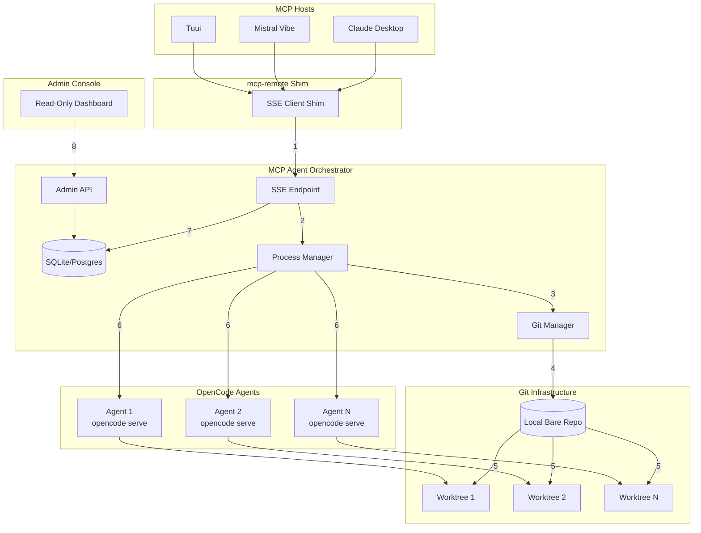
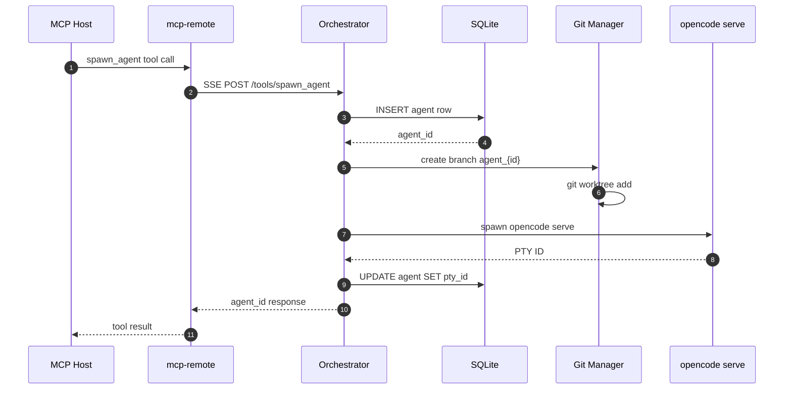
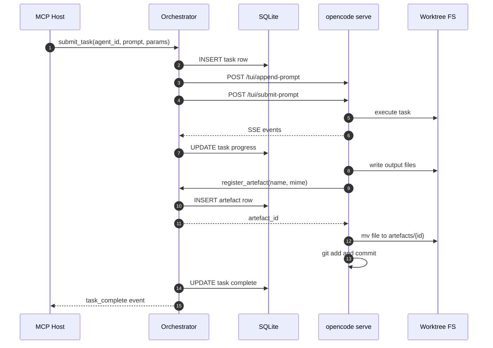
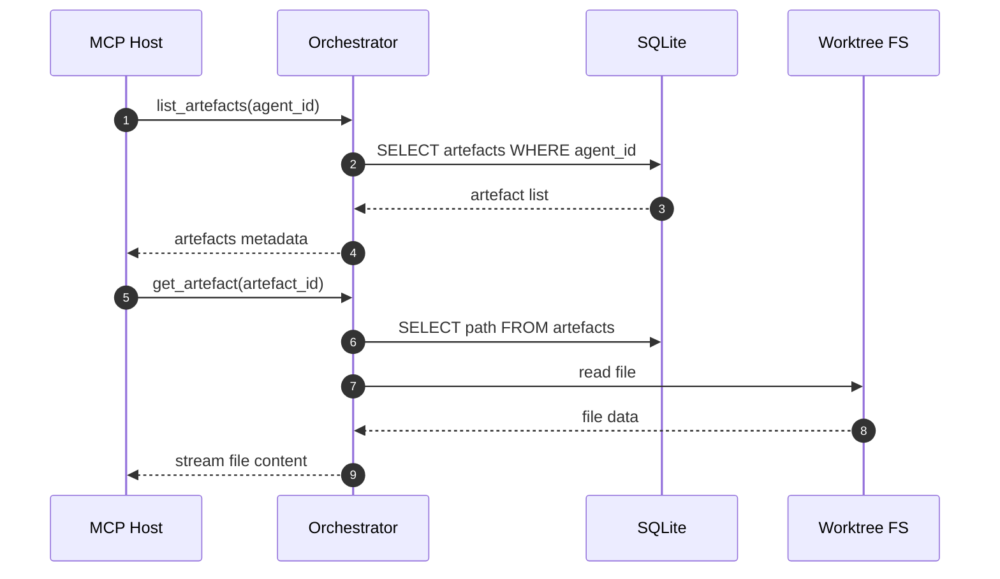
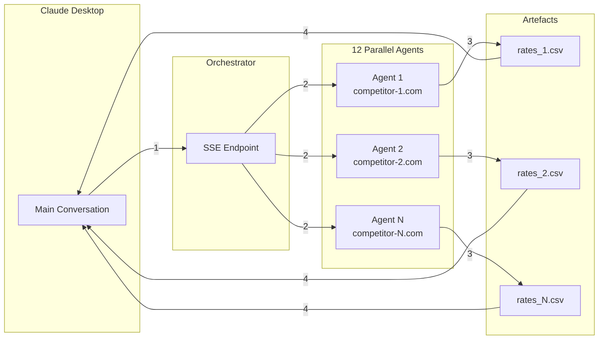

# MCP Agent Orchestrator - Target Architecture

## Vision

The **MCP Agent Orchestrator** is a control plane that enables MCP hosts (Claude Desktop, Mistral Vibe, Tuui, etc.) to delegate complex, isolated, concurrent tasks to OpenCode agents. It provides:

- **Isolation**: Each agent operates in its own Git worktree with no shared state
- **Concurrency**: Hundreds of transient agents per month, fully tracked
- **Automation**: Full lifecycle management without polluting the user's main repositories
- **Portability**: Runs on Lima VM (macOS), WSL (Windows), or remote VPS

The orchestrator acts as a **subagent factory** - MCP hosts spawn agents via SSE, the orchestrator manages their lifecycles, and artefacts flow back through registered outputs.

## High-Level Architecture



| # | Label | Description |
|---|-------|-------------|
| 1 | SSE Connection | MCP hosts connect via mcp-remote shim to orchestrator SSE endpoint |
| 2 | Process Management | SSE requests trigger process manager for agent lifecycle |
| 3 | Git Operations | Process manager delegates to Git manager for worktree setup |
| 4 | Bare Repo | Local bare repo stores all agent branches (no GitHub) |
| 5 | Worktrees | Each agent gets isolated worktree branched from bare repo |
| 6 | Agent Spawn | Process manager launches opencode serve instances per agent |
| 7 | State Tracking | All operations logged to SQLite/Postgres for tracking |
| 8 | Admin Read | Dashboard reads from database (all writes via SSE/API) |

## Component Details

### 1. MCP Agent Orchestrator

The orchestrator is a **durable SSE MCP server** with:

- **PID Management**: `./run.sh start|stop|restart|status|logs`
- **SSE Endpoint**: Handles MCP tool calls from hosts
- **Admin API**: RESTful interface for dashboard (read-only for now)
- **Database**: SQLite (abstracted via `db.ts` for future Postgres)
- **Process Manager**: Spawns/monitors opencode serve instances
- **Git Manager**: Creates branches, worktrees, commits artefacts

### 2. Claude Desktop Stdin Shim

Claude Desktop cannot directly use SSE. The shim pattern:

```json
{
  "mcpServers": {
    "mcp-agent-orchestrator": {
      "command": "/opt/homebrew/bin/bunx",
      "args": [
        "-y",
        "mcp-remote",
        "http://my.lima.vm:8000/sse",
        "--allow-http",
        "--header",
        "X-Profile: default"
      ]
    }
  }
}
```

The `X-Profile` header maps the MCP host to a specific orchestrator profile (repo configuration, tools enabled, etc.).

### 3. Local Bare Repo Strategy

Git is used as an **object store** with linear history:

```
/orchestrator-data/
  repos/
    profile-default.git/     # Bare repo for "default" profile
    profile-coding.git/      # Bare repo for "coding" profile
  worktrees/
    agent-001/               # Worktree for agent 001
    agent-002/               # Worktree for agent 002
  artefacts/
    <artefact-uuid>/         # Committed artefact data
```

**Key principles**:
- Each profile has its own bare repo
- Agents branch from an early empty commit (for scratch work) or from a cloned GitHub repo (for coding)
- All branches stay local - push to GitHub is explicit "export from sandbox"
- Rollback = git reset on the agent's branch

### 4. Read-Only Admin Console

The dashboard provides:
- List of active agents with status
- Task queue and completion state
- Artefact browser
- Disk usage and cleanup tools
- Policy management (auto-terminate after N days)

**All writes go through the MCP server loop** - the dashboard only reads from SQLite.

## Sequence Diagrams

### Agent Spawn Flow



| # | Description |
|---|-------------|
| 1 | MCP host invokes spawn_agent tool |
| 2 | Shim forwards to orchestrator SSE endpoint |
| 3 | Orchestrator creates agent record in database |
| 4 | Database returns generated agent_id |
| 5 | Git manager creates branch for agent |
| 6 | Git manager creates worktree for isolation |
| 7 | Orchestrator spawns opencode serve in worktree |
| 8 | OpenCode returns PTY session ID |
| 9 | Orchestrator updates agent with PTY reference |
| 10 | Response flows back to shim |
| 11 | Host receives agent_id for future operations |

### Task Execution Flow



| # | Description |
|---|-------------|
| 1 | Host submits task with prompt and parameters |
| 2 | Orchestrator creates task record |
| 3 | Orchestrator appends prompt to OpenCode TUI |
| 4 | Orchestrator submits prompt for execution |
| 5 | OpenCode executes task in isolated worktree |
| 6 | OpenCode streams progress events |
| 7 | Orchestrator updates task status in database |
| 8 | OpenCode writes output files to worktree |
| 9 | OpenCode registers artefact with orchestrator |
| 10 | Orchestrator creates artefact record |
| 11 | Orchestrator returns artefact_id |
| 12 | OpenCode moves file to artefacts directory |
| 13 | OpenCode commits artefact to Git |
| 14 | Orchestrator marks task complete |
| 15 | Host receives completion notification |

### Artefact Retrieval Flow



| # | Description |
|---|-------------|
| 1 | Host requests list of artefacts for agent |
| 2 | Orchestrator queries database |
| 3 | Database returns artefact metadata |
| 4 | Host receives list with IDs, names, mimetypes |
| 5 | Host requests specific artefact content |
| 6 | Orchestrator looks up file path |
| 7 | Orchestrator reads file from worktree |
| 8 | File data returned |
| 9 | Content streamed back to host |

## Database Schema (Spike)

```sql
-- Profiles define repo configurations
CREATE TABLE profiles (
    id TEXT PRIMARY KEY,
    name TEXT NOT NULL,
    bare_repo_path TEXT NOT NULL,
    created_at TIMESTAMP DEFAULT CURRENT_TIMESTAMP
);

-- Agents are spawned instances
CREATE TABLE agents (
    id TEXT PRIMARY KEY,
    profile_id TEXT NOT NULL REFERENCES profiles(id),
    host_id TEXT,
    branch_name TEXT NOT NULL,
    worktree_path TEXT NOT NULL,
    pty_id TEXT,
    opencode_port INTEGER,
    status TEXT CHECK(status IN ('starting', 'running', 'idle', 'error', 'terminated')),
    created_at TIMESTAMP DEFAULT CURRENT_TIMESTAMP,
    updated_at TIMESTAMP DEFAULT CURRENT_TIMESTAMP
);

-- Tasks are work items for agents
CREATE TABLE tasks (
    id TEXT PRIMARY KEY,
    agent_id TEXT NOT NULL REFERENCES agents(id),
    prompt TEXT NOT NULL,
    params TEXT,  -- JSON
    status TEXT CHECK(status IN ('pending', 'running', 'completed', 'failed', 'cancelled')),
    created_at TIMESTAMP DEFAULT CURRENT_TIMESTAMP,
    completed_at TIMESTAMP
);

-- Artefacts are outputs from tasks
CREATE TABLE artefacts (
    id TEXT PRIMARY KEY,
    task_id TEXT NOT NULL REFERENCES tasks(id),
    agent_id TEXT NOT NULL REFERENCES agents(id),
    name TEXT NOT NULL,
    mimetype TEXT NOT NULL,
    path TEXT NOT NULL,
    size_bytes INTEGER,
    committed BOOLEAN DEFAULT FALSE,
    created_at TIMESTAMP DEFAULT CURRENT_TIMESTAMP
);

-- Conversation threads from MCP hosts
CREATE TABLE conversations (
    id TEXT PRIMARY KEY,
    host_id TEXT NOT NULL,
    profile_id TEXT REFERENCES profiles(id),
    created_at TIMESTAMP DEFAULT CURRENT_TIMESTAMP
);

-- Link conversations to agents
CREATE TABLE conversation_agents (
    conversation_id TEXT REFERENCES conversations(id),
    agent_id TEXT REFERENCES agents(id),
    PRIMARY KEY (conversation_id, agent_id)
);
```

## MCP Tools Exposed

The orchestrator exposes these tools to MCP hosts:

| Tool | Description |
|------|-------------|
| `spawn_agent` | Create new agent with profile, returns agent_id |
| `submit_task` | Submit prompt/params to agent, returns task_id |
| `list_agents` | List agents for current conversation |
| `get_agent_status` | Get agent status (running/idle/error) |
| `list_tasks` | List tasks for an agent |
| `get_task_status` | Get task completion status |
| `list_artefacts` | List artefacts for agent/task |
| `get_artefact` | Stream artefact content |
| `write_artefact_to_file` | Write artefact to host filesystem |
| `terminate_agent` | Stop agent and cleanup worktree |

## OpenCode Serve Integration

The orchestrator uses the OpenCode Serve API:

**PTY Management**:
- `POST /pty` - Create PTY session for opencode serve
- `GET /pty` - List active PTY sessions
- `GET /pty/{id}/connect` - WebSocket for PTY I/O
- `DELETE /pty/{id}` - Terminate PTY

**TUI Control**:
- `POST /tui/append-prompt` - Add text to prompt
- `POST /tui/submit-prompt` - Execute prompt
- `POST /tui/execute-command` - Run TUI command

**Events**:
- SSE stream for session.status, message.updated, etc.

## Use Case 1: Parallel Agent Tasks (PDF Scraping Example)

**Scenario**: Claude Desktop needs to scrape 12 competitor websites for PDF mortgage rates.



| # | Label | Description |
|---|-------|-------------|
| 1 | Spawn 12 agents | Claude Desktop spawns agent per competitor URL |
| 2 | Execute tasks | Each agent runs PDF scraping in isolation |
| 3 | Produce artefacts | Agents output CSV/MD/XLSX files |
| 4 | Harvest results | Claude Desktop retrieves completed artefacts |

**Key benefits**:
- No crash from Claude Desktop sandbox limits
- Full isolation - agents cannot interfere
- Parallel execution - all 12 run simultaneously
- Tracked state - nothing gets lost

## Use Case 2: Parallel Coding Agents (Stub)

**Scenario**: High agent concurrency while programming in parallel - run the same task under three models and use the first reasonable answer, delete the rest.

**Key requirements**:
- Automate git-worktrees for hundreds of agents per week
- Track which task of 100 this weekend was forgotten
- Export winning result to GitHub PR
- Cleanup losing branches automatically

**Architecture considerations**:
- Clone GitHub repo to local bare repo
- All agent branches stay in sandbox
- Only explicit "export" pushes to GitHub
- Policy-based auto-cleanup (30 days, etc.)

*Detailed design TBD - this is enterprise-level agentic engineering.*

## Technology Stack

- **Runtime**: Bun (bunx for scripts)
- **SSE Server**: Hono or Elysia (Bun-native)
- **Database**: SQLite via better-sqlite3 (Postgres later via db.ts abstraction)
- **Git Operations**: isomorphic-git or shell commands
- **Admin UI**: SolidJS or vanilla HTML (read-only)
- **Process Management**: Custom PID file + run.sh wrapper

## Deployment Targets

| Target | Description |
|--------|-------------|
| Lima VM (macOS) | Primary development environment |
| WSL (Windows 11) | Windows development |
| VPS (Cloud) | Remote deployment with TLS |
| Docker | Container deployment option |

## Security Considerations

- **Local-first**: No external connections by default
- **Profile isolation**: Each profile has separate bare repo
- **Agent isolation**: Worktrees cannot access each other
- **Admin auth**: Future - JWT/API key for dashboard
- **TLS**: Required for remote deployment

## Next Steps

1. **Spike**: Minimal bunx SSE server with one agent spawn
2. **Validate**: Test isolation with concurrent agents
3. **Database**: Implement full schema with db.ts abstraction
4. **Admin UI**: Read-only dashboard for monitoring
5. **Hardening**: PID management, logging, cleanup policies
